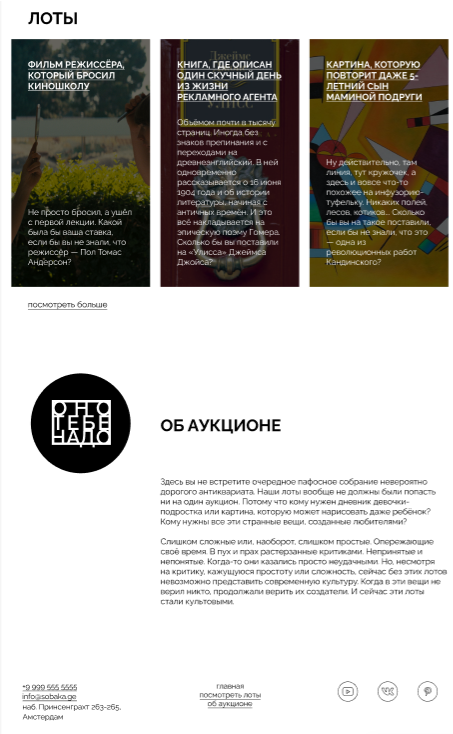

# Верстка лендинга по макету Figma

Мой первый проект по верстке - точное воспроизведение макета из Figma с использованием современных веб-технологий:

- Работа с макетами Figma
- Навыки Pixel Perfect верстки
- Семантическая HTML-разметка
- CSS Flexbox и Grid системы

 

## Стек

 
